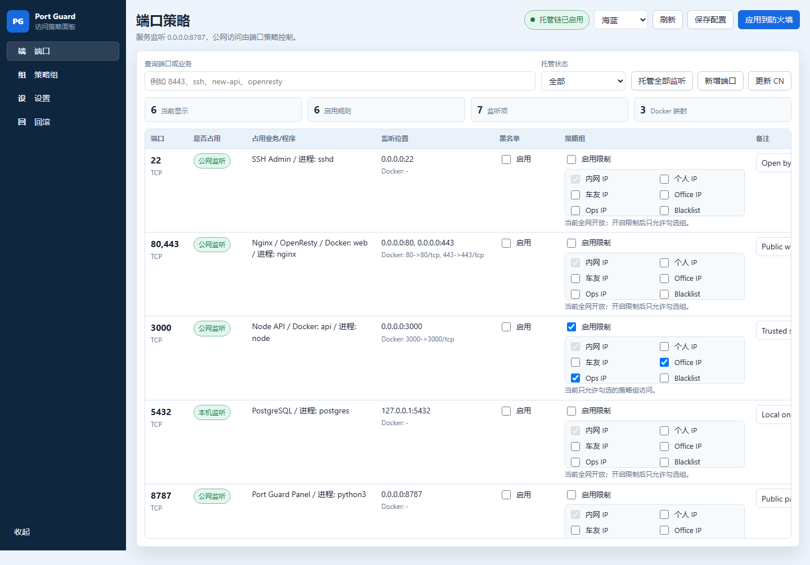
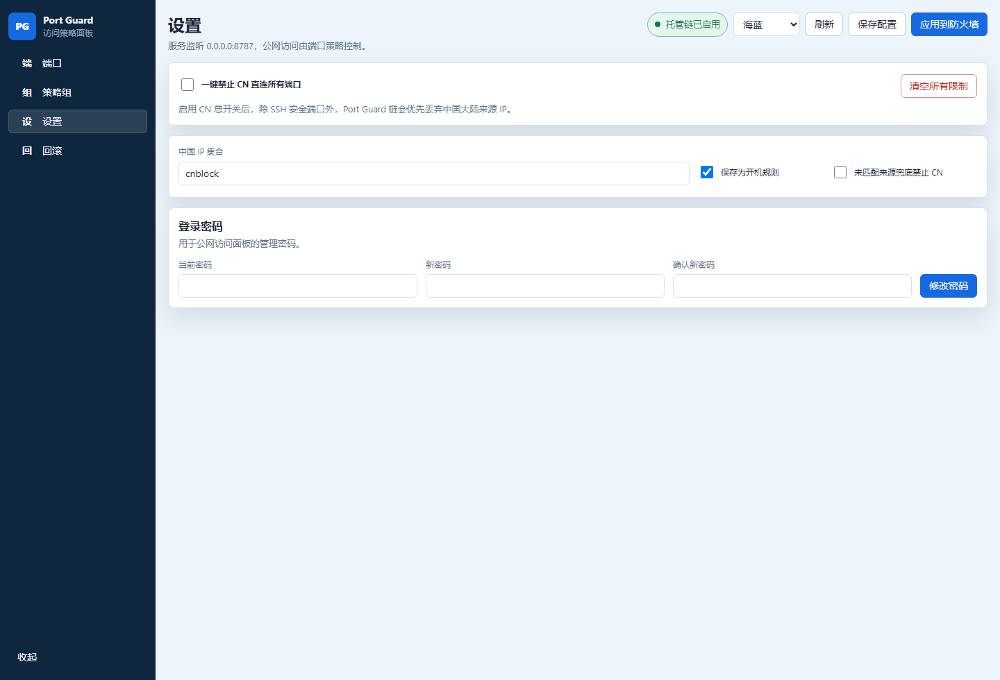

<div align="center">

# Port Guard

**Linux 服务器端口防火墙可视化管理面板**


一个轻量、直观、开箱即用的服务器端口管理面板。扫描当前端口，托管访问策略，减少手写 iptables 规则的重复劳动。

[友情链接：LINUX DO](https://linux.do/)

</div>

---

## 界面预览

### 端口策略

自动识别宿主机监听端口和 Docker 发布端口，可直接设置开放、限制来源、黑名单、关闭等策略。



### 设置与密码

默认公网可访问，使用密码登录；设置页可修改密码、控制 CN 拦截和规则持久化。



---

## 适合场景

Port Guard 适合这些常见服务器场景：

| 场景 | 说明 |
| --- | --- |
| 个人 VPS | 快速查看哪些端口正在对外监听，并统一托管 |
| Docker 主机 | 看清 Docker 发布端口，并把容器入口纳入策略 |
| 多服务机器 | Web、API、面板、数据库、VPN 等端口集中管理 |
| 临时放行 | 新服务上线后先全网开放，再按需要收紧来源 |
| 低运维门槛 | 不需要手写复杂 iptables 命令 |

---

## 默认行为

Port Guard 默认面向公网使用，安装完成后直接打开：

```text
http://服务器IP:8787
```

默认登录密码：

```text
admin
```

首次安装时会自动扫描当前正在使用的端口，并把这些端口设置为“全网开放”，无白名单、无黑名单、无 CN 拦截。

| 项目 | 默认行为 |
| --- | --- |
| 面板监听 | `0.0.0.0:8787`，公网可访问 |
| 登录方式 | 密码登录，默认密码 `admin` |
| 防爆破 | 同一 IP 1 分钟内失败超过 5 次会被临时锁定 |
| 首次端口策略 | 自动开放当前正在监听的端口 |
| CN 总开关 | 默认关闭，不会拦截中国大陆来源 IP |
| 首次策略备份 | 不备份原有 iptables 策略 |
| 原有防火墙策略 | 不清空，只插入 Port Guard 自己的管理链 |
| 后续手动应用 | 在面板点击应用规则时才会创建回滚备份 |

安装后建议第一时间进入“设置”修改默认密码。

---

## 一键安装

已经 SSH 进入服务器后，直接执行：

```bash
curl -fsSL https://raw.githubusercontent.com/Timmyzzo/Port-Guard/refs/heads/main/install.sh | sudo bash
```

安装脚本只考虑 Debian / Ubuntu 系统，会自动完成：

- 安装 `python3`、`iptables`、`ipset`、`iproute2` 等依赖。
- 下载并安装 Port Guard 到 `/opt/port-guard-ui`。
- 写入 systemd 服务。
- 默认监听公网 `8787` 端口。
- 默认密码设置为 `admin`。
- 首次启动时打开当前正在使用的端口。

安装完成后访问：

```text
http://服务器IP:8787
```

如果打不开，优先检查云厂商安全组是否放行 `8787/tcp`。

---

## 升级已有安装

已经安装过旧版本时，仍然执行同一行命令即可：

```bash
curl -fsSL https://raw.githubusercontent.com/Timmyzzo/Port-Guard/refs/heads/main/install.sh | sudo bash
```

升级会覆盖程序文件并重启服务，但不会删除已有配置：

| 保留内容 | 路径 |
| --- | --- |
| 端口策略配置 | `/etc/port-guard-ui/config.json` |
| 登录密码 | `/etc/port-guard-ui/auth.json` |
| 回滚备份 | `/var/backups/port-guard-ui` |

---

## 功能概览

| 能力 | 说明 |
| --- | --- |
| 端口扫描 | 读取宿主机监听端口和 Docker 端口映射 |
| 一键托管 | 把当前监听端口加入管理，默认全网开放 |
| 策略管理 | 支持全网开放、策略组放行、禁止中国 IP、黑名单、仅本机/隧道 |
| 密码登录 | 默认密码 `admin`，可在设置页修改 |
| 防爆破 | 同一 IP 1 分钟内登录失败超过 5 次会临时锁定 |
| 备份回滚 | 后续手动应用规则时自动创建 iptables 备份 |
| Docker 识别 | 自动展示 Docker 已发布端口 |
| 轻量部署 | 单个 Python 服务加静态前端，无数据库、无前端构建 |

---

## 使用流程

1. 打开 `http://服务器IP:8787`。
2. 使用默认密码 `admin` 登录。
3. 进入“设置”，修改登录密码。
4. 在端口列表查看当前监听端口。
5. 需要新增托管时，点击“托管全部监听”。
6. 修改策略后点击“应用到防火墙”。

---

## 防火墙边界

Port Guard 只管理自己的链，不会把整台机器的 iptables 清空。

| 链 | 用途 |
| --- | --- |
| `PORTGUARD-INPUT` | 管理宿主机监听端口 |
| `PORTGUARD-DOCKER` | 管理 Docker 发布端口 |

首次安装时不会备份原有规则；后续你在面板中点击“应用到防火墙”时，会自动创建回滚点。

---

## 常用策略

| 模式 | 效果 |
| --- | --- |
| 全网开放 | 所有人都能访问该端口 |
| 策略组放行 | 只有选中的来源 IP/CIDR 能访问 |
| 禁止中国 IP | 丢弃中国大陆来源 IP，其他来源放行 |
| 除黑名单外开放 | 默认开放，但拒绝黑名单来源 |
| 仅本机/隧道 | 不开放公网直连 |

---

## 云安全组

如果面板或业务端口打不开，通常不是 Port Guard 没启动，而是云厂商安全组没放行。

至少需要放行：

| 协议 | 端口 | 来源 |
| --- | --- | --- |
| TCP | `8787` | `0.0.0.0/0` |

如果你希望服务器上的业务端口也都能公网访问，请在云控制台按需放行对应端口。

---

## 配置文件

环境变量：

```text
/etc/port-guard-ui.env
```

主配置：

```text
/etc/port-guard-ui/config.json
```

密码文件：

```text
/etc/port-guard-ui/auth.json
```

备份目录：

```text
/var/backups/port-guard-ui
```

---

## 常用命令

查看服务：

```bash
sudo systemctl status port-guard-ui --no-pager
```

查看日志：

```bash
sudo journalctl -u port-guard-ui -f
```

重启服务：

```bash
sudo systemctl restart port-guard-ui
```

查看当前监听端口：

```bash
sudo ss -lntup
```

查看 Port Guard 管理链：

```bash
sudo iptables -S PORTGUARD-INPUT
sudo iptables -S PORTGUARD-DOCKER
```

---

## 卸载

```bash
sudo systemctl disable --now port-guard-ui
sudo rm -f /etc/systemd/system/port-guard-ui.service
sudo rm -rf /opt/port-guard-ui
sudo systemctl daemon-reload
```

默认不会删除 `/etc/port-guard-ui` 和 `/var/backups/port-guard-ui`，避免误删配置和回滚点。确认不需要后可以手动删除。

---

## 回滚

后续在面板手动应用规则时会生成备份。如果需要从控制台、VNC 或救援模式回滚：

```bash
sudo iptables-restore < /var/backups/port-guard-ui/iptables-YYYYMMDDTHHMMSSZ.rules
```

---

## 开源推广声明

本项目参与 [LINUX DO](https://linux.do/) 开源推广，项目主页已添加 LINUX DO 友链。

- [x] 项目代码公开可访问。
- [x] README 已提供安装方式、功能说明和界面截图。
- [x] README 已添加 [LINUX DO](https://linux.do/) 友链。
- [x] 欢迎社区用户提交 Issue、反馈建议和改进 PR。

---

## 本地开发

```bash
sudo PORT_GUARD_HOME="$PWD" \
  PORT_GUARD_CONFIG_DIR="$PWD/.local/config" \
  PORT_GUARD_BACKUP_DIR="$PWD/.local/backups" \
  PORT_GUARD_BIND=127.0.0.1 \
  PORT_GUARD_PORT=8787 \
  PORT_GUARD_DEFAULT_PASSWORD=admin \
  python3 server.py
```

语法检查：

```bash
python3 -m py_compile server.py
node --check static/app.js
```

---

## 项目结构

```text
.
├── install.sh
├── server.py
├── docs/
│   └── screenshots/
│       ├── port-guard-ports.png
│       └── port-guard-settings.png
├── static/
│   ├── app.js
│   ├── index.html
│   └── styles.css
└── examples/
    ├── config.example.json
    ├── port-guard-ui.env.example
    └── port-guard-ui.service
```

---

<div align="center">

**默认公网访问，默认密码 admin，首次自动开放当前正在使用的端口。**

</div>
